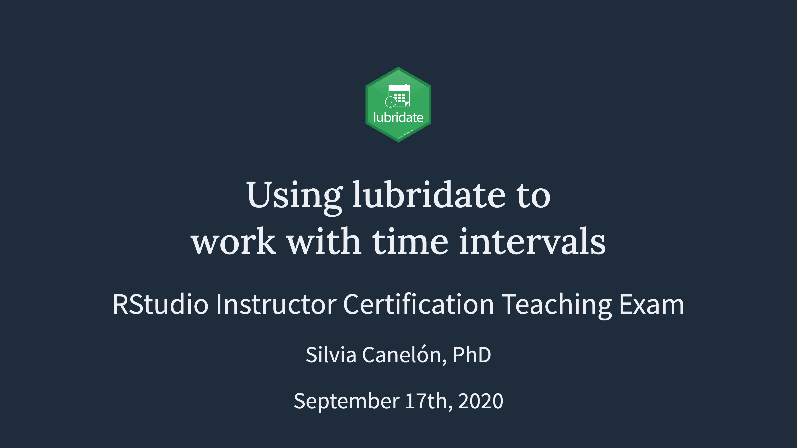

# RStudio Instructor Certification Teaching Exam
Repo for material relating to the RStudio Instructor Certification teaching exam

# Learner Persona
Carmen is a graduate student in an informatics lab that works with clinical data for her research. She is a competent user of the core tidyverse packages but has limited experience working with dates and until now has been piecing together bits of useful code from various examples found online. Her next research project will require longitudinal analyses and modeling using a particular patient cohort, so she'd like to incorporate lubridate tools into her workflow. Carmen has a full courseload and research responsibilities, so the time she can spend learning R is limited -- the faster she can learn to apply the tools she needs, the better!

# Slides
## [spcanelon.github.io/rit-teaching-exam](https://spcanelon.github.io/rit-teaching-exam/)

# R Markdown files

## [Live demo](lubridate_livecode.Rmd)

## [Live demo + solutions](lubridate_livecode_solutions.Rmd)
