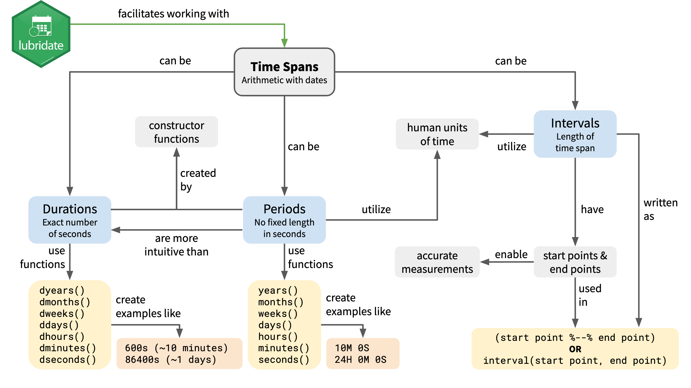
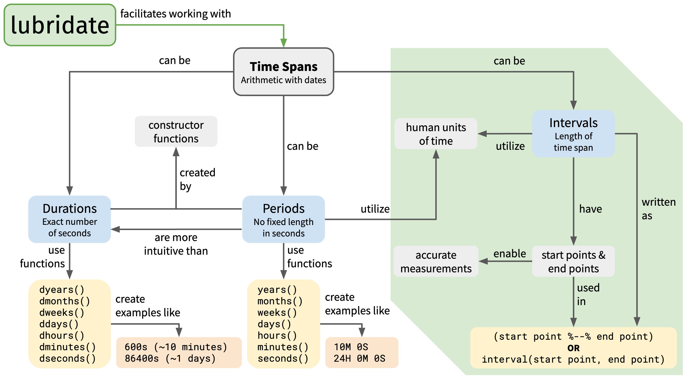
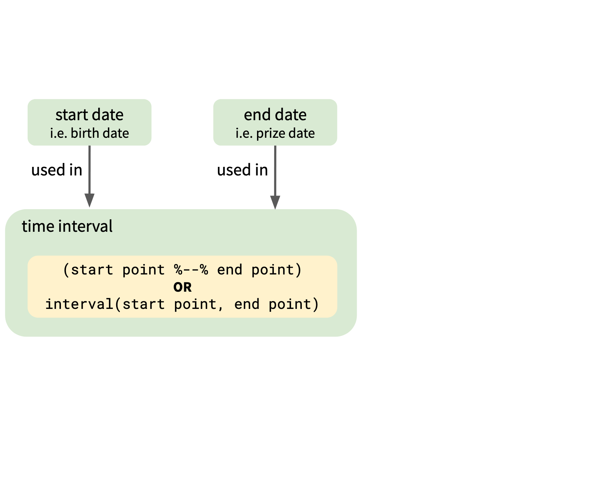
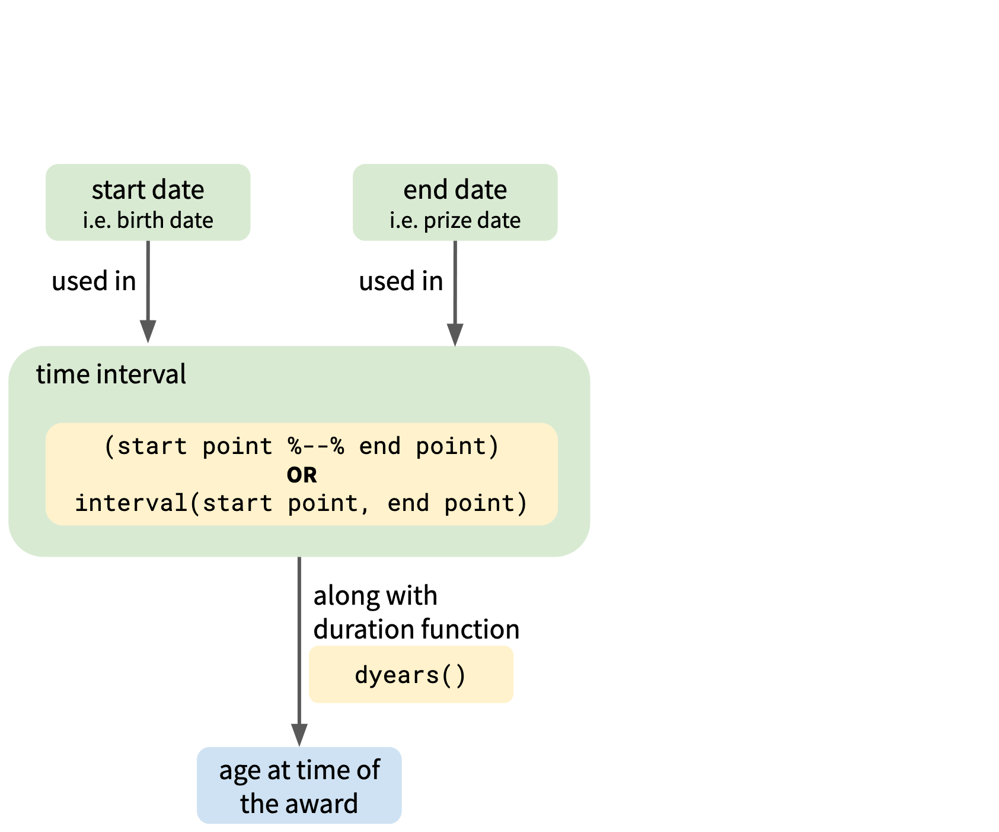
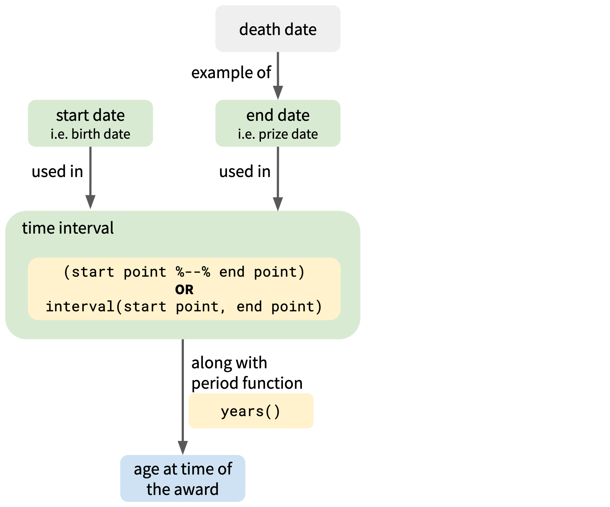
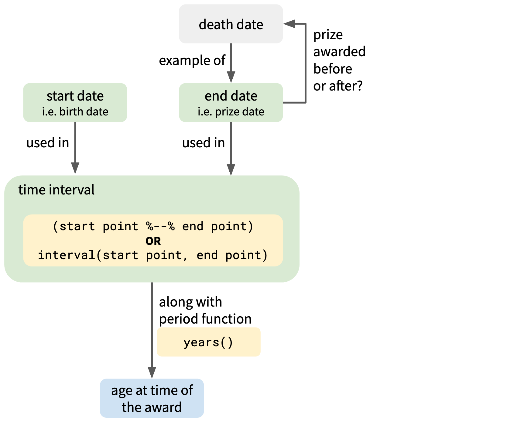
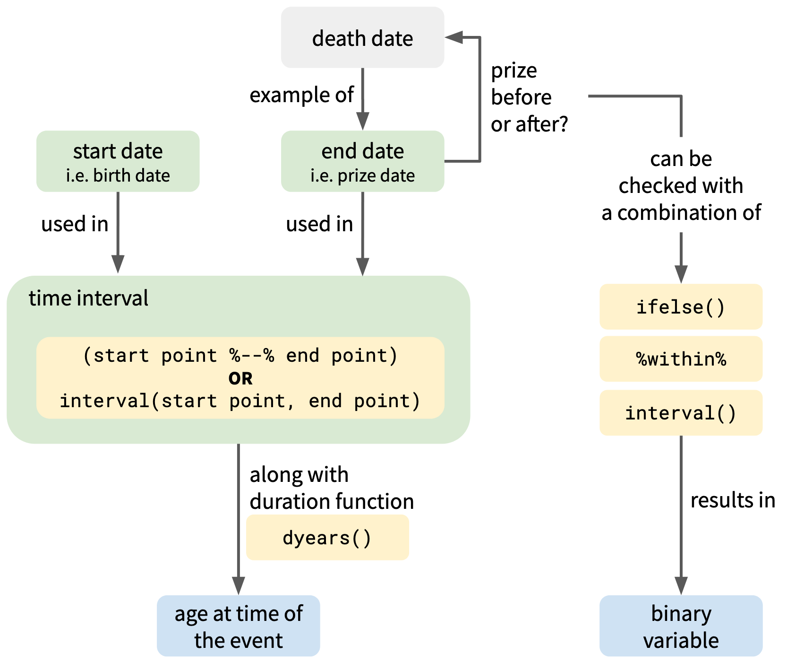

```{r setup, include=FALSE}
options(htmltools.dir.version = FALSE)
knitr::opts_chunk$set(collapse = TRUE,
                      fig.retina = 3,
                      warning = FALSE,
                      message = FALSE)

library(tidyverse)
library(lubridate)
library(xaringanExtra)
xaringanExtra::use_xaringan_extra(include = c("panelset", "tile_view", "share_again", "use_broadcast"))
xaringanExtra::style_share_again(share_buttons = c("twitter", "linkedin", "pocket"))
xaringanExtra::embed_xaringan(
  url = "https://spcanelon.github.io/rit-teaching-exam", ratio = "16:9")
```

class: title-slide, center, bottom

```{r, echo=FALSE, out.width=100}
knitr::include_graphics("images/lubridate_hex.png")
```
# `r rmarkdown::metadata$title`

## `r rmarkdown::metadata$subtitle`

### `r rmarkdown::metadata$author`

### `r rmarkdown::metadata$date`

---
class: left, middle
# This week: Time spans in lubridate


---
class: left, middle
# Today's lesson: intervals


---
class: left, middle

# The dataset contains information about

### `r icon::fa("user-friends")` All Nobel laureates (i.e. date of birth, date of death)

--
### `r icon::fa("award")` The Nobel Prize Award (i.e. year of the award)

--
### Originally prepared by [Kaggle](https://www.kaggle.com/nobelfoundation/nobel-laureates#archive.csv) and then<br/>made available for [TidyTuesday on 2019-05-14](https://github.com/rfordatascience/tidytuesday/blob/3040e14f3b4934e6fc621f57d78324b53e549086/data/2019/2019-05-14/readme.md)

---
class: inverse, center, middle

# Examples

## 1. .bold[Calculate laureate's age at the time of the award]
 
## 2. Determine if the prize was awarded<br/>during the laureate's lifetime

---
.left-column[
### .bold[`r icon::fa("lightbulb")` Goal] Calculate laureate's age at the time of the award
]
.right-column[

]

---
.left-column[
### .bold[`r icon::fa("lightbulb")` Goal] Calculate laureate's age at the time of the award


]
.right-column[

]

---
# `r icon::fa("brain")` Knowledge check
## What would we write to find a time interval?

### a. `interval(start_point) - interval(end_point)`

### b. `start_point - end_point`

### c. `interval(start_point, end_point)`

### d. `start_point %--% end_point`

--

## `r icon::fa("check-square")` Correct answers: c and d

---
class: title-slide, center, middle
# Let's go live!

## `r icon::fa("code")`


---
class: inverse, center, middle

# Examples

## 1. Calculate laureate's age at the time of the award
 
## 2. .bold[Determine if the prize was awarded<br/>during the laureate's lifetime]

---
.left-column[
### .bold[`r icon::fa("lightbulb")` Goal] Determine if the prize was awarded during the laureate's lifetime
]

.right-column[

]

---
.left-column[
### .bold[`r icon::fa("lightbulb")` Goal] Determine if the prize was awarded during the laureate's lifetime
]

.right-column[

]

---
.left-column[
### .bold[`r icon::fa("lightbulb")` Goal] Determine if the prize was awarded during the laureate's lifetime
]

.right-column[

]

---
.left-column[
### .bold[`r icon::fa("lightbulb")` Goal] Determine if the prize was awarded during the laureate's lifetime
]

.right-column[

]

---
# `r icon::fa("brain")` Knowledge check
## How would we complete the following?

```{r eval=FALSE}
nobel_laureates %>%
  mutate(new_variable = 
           ifelse(prize_date %within% _______(start_point, end_point), 1, 0)) #<<
```

--
## `r icon::fa("check-square")` Correct answer:

```{r eval=FALSE}
nobel_laureates %>%
  mutate(new_variable = 
           ifelse(prize_date %within% interval(start_point, end_point), 1, 0))
```

---
class: title-slide, center, middle

# Let's go live!

## `r icon::fa("code")`

---
class: title-slide, center, middle

# Fin.

## Thank you!

## `r icon::fa("chalkboard-teacher")`